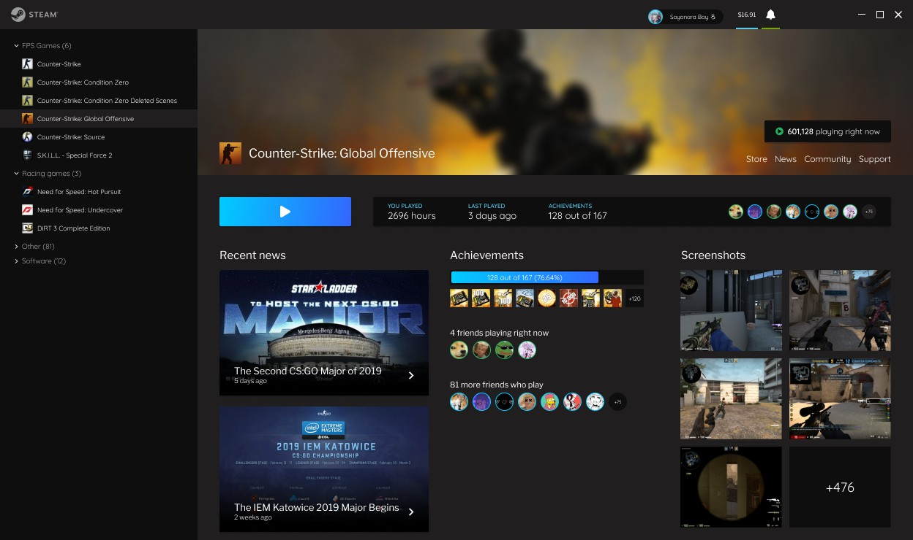

# webforsteam
> steam要改版了，尝试用web实现一个新版steam的布局吧。————设计稿来自网络搜集

Steam介绍页面的动画图片最近进行了更新，虽然看起来十分模糊和抽象，不够看得出图片中的界面设计与现在的不同，也许这是未来Steam界面更新的方向。


从动画中可以看到游戏库和商店页面似乎在同一个页面上，Reddit网友u/inteNsE--参考这个图片为Steam设计了一个新UI，看上去确实不错。



这个UI做成网站界面，也是很不错了。
在不远的将来，我坚信云游戏势必流行，直接用web畅玩3A大作，web游戏库系统则是必须要做的了。


## Build Setup

``` bash
# install dependencies
npm install

# serve with hot reload at localhost:8080
npm run dev

# build for production with minification
npm run build

# build for production and view the bundle analyzer report
npm run build --report
```